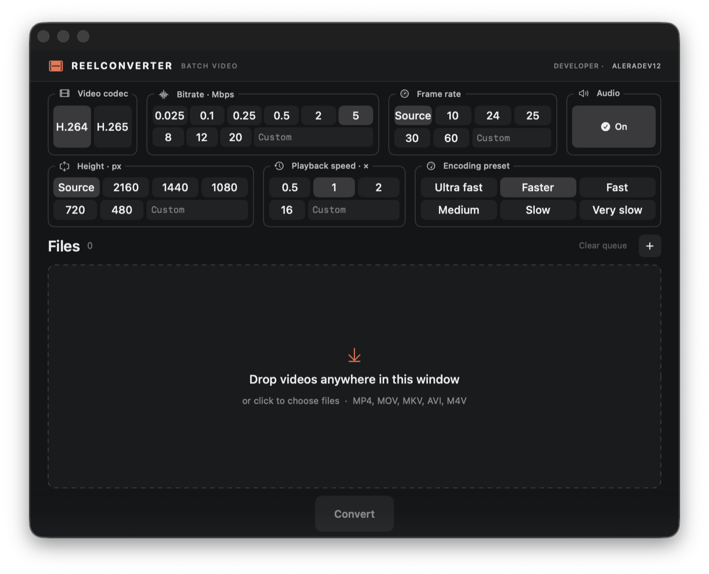

# ReelConverter

**Quickly shrink a screen recording or change its playback speed on macOS.** ReelConverter is a small, native video converter for getting a recording ready to send in a chat or attach to an issue in a work tracker. Drop in a file, pick a smaller bitrate or a different speed, and convert it to MP4. No editing timeline or project setup.



## What it does

- Convert several videos in one queue by dragging them into the window or clicking **+**.
- Open a video from Finder with **Open With → ReelConverter**. This adds it to the queue; conversion starts only when you click **Convert**.
- Choose H.264 or H.265, bitrate, frame rate, output height, playback speed, encoding preset, and whether to keep audio.
- Save MP4 files next to the originals. The original is left untouched; if an output name already exists, the next file gets ` (1)`, ` (2)`, and so on.
- Follow your system appearance or switch between light and dark themes.

ReelConverter is intentionally simple. It was made to compress screen recordings for sharing and to speed up or slow down clips without opening a full video editor. The goal is to keep it small; new features are only considered if they make that workflow easier without adding complexity.

## Install

**Requires macOS 13 or later.** Download a ZIP for your Mac's architecture from [GitHub Releases](https://github.com/aleradev12/reelconverter/releases), unzip it, and move `ReelConverter.app` to Applications. Check the assets listed on the release page for supported architectures.

ReelConverter uses [FFmpeg](https://ffmpeg.org/) and `ffprobe` but does not bundle them. On first launch, if either is missing, the app can offer to install FFmpeg through [Homebrew](https://brew.sh/). You can also install it yourself with `brew install ffmpeg`.

> **Note:** Builds without Apple Developer ID signing and notarization may be blocked by macOS Gatekeeper. The current build script creates an ad-hoc signature only. Do not disable Gatekeeper system-wide.

## Use

1. Drag an MP4, MOV, M4V, AVI, or MKV into the window, click **+**, or choose **Open With → ReelConverter** in Finder. Finder may show the app under **Other…** on first use.
2. Leave the defaults or adjust the settings. For a smaller screen recording, try a lower bitrate; for a slower or faster clip, change **Playback speed**.
3. Click **Convert**. Find the converted MP4 next to the source, or use the folder button in the queue to reveal it.

Files opened while the app is running join the same queue. All files use the settings shown when each conversion begins. If you need different settings for different files, convert them in separate runs.

## Build from source

Requires Xcode Command Line Tools or Xcode with Swift 5.9+:

```sh
brew install ffmpeg
./scripts/build-app.sh
open dist/ReelConverter.app
```

The build is for the current Mac architecture. Source code is licensed under the [MIT License](LICENSE).
